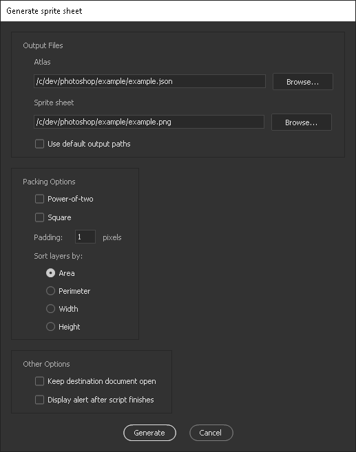

# Sprite sheet and atlas generator script for Adobe Photoshop
Simple but versatile Photoshop script for automated generation of spritesheets and JSON atlases directly from a Photoshop document.

## What it does
This script copies individual layers from your Photoshop document and packs them neatly into a spritesheet,
without the need for manual layouting. Along with the spritesheet, the script generates an accompanying JSON atlas file, which contains the bounding rectangles and positions for the individual frames/sprites.

Additional data, such as relative positions and anchor points can also be included in the atlas if desired, by using a simple tag system in your Photoshop layer hierarchy (discussed more thoroughly further below). You can then read the atlas in your application with a JSON parser of your choice, allowing for nimble integration of graphics to your application.

After the initial setup of your Photoshop document structure, the script requires no further manual preparation before each run of the script, and no modifications to your original Photoshop document are made by the script. This way you can rapidly modify and test out your graphics.

The script was written mainly with "pixel art-ish" 2D games in mind, but should work just fine with higher-resolution raster graphics too.

## Installation
Simply drop the contents of the [src](src) folder to where the other Photoshop scripts reside on your system, usually something like

- Windows: _.../Program Files/Adobe/Adobe Photoshop XXXX/Presets/Scripts/_
- Mac: _Applications/Adobe Photoshop XXXX/Presets/Scripts_

**You can also save the script files in an arbitrary location, create a shortcut pointing to _SpriteSheetGenerator.jsx_ and place said shortcut into the Photoshop Scripts folder.**

After installation, restart Photoshop and the script can be found in
_File->Scripts->SpriteSheetGenerator_.
You may also want to setup a keyboard shortcut to run the script in Photoshop, for additional convenience.

## Options
When you run the script, you are first prompted with a few options. These are self-explanatory for the most part, but I'll make a few quick remarks:



### Paths
If default output paths are used, a new folder will be created in the same directory where the current .psd file resides.
The folder's name will be the same as that of the .psd document. The output .png and .json files are placed into that folder, both also named after the .psd document.

Like so:
```
root
├── exampleDoc.psd
└── exampleDoc
    ├── exampleDoc.png
    └── exampleDoc.json
```
### Packing options

#### Power-of-two
- Enabled: Forces the width and height of the output sprite sheet to be powers of two (individually that is, the sheet will not necessarily be square). Can be useful For GPU optimization purposes.
- Disabled: The output sprite sheet will be trimmed down to minimum size after generation. 

#### Square
- Enabled: Forces width and height to be equal in the output sprite sheet.

#### Padding:
- Number of empty pixels surrounding each sprite/frame. Zero padding seems to sometimes cause artifacts, especially with antialiasing. A padding of one to a few pixels seems to be sufficient in my experience, but depends on your application, of course.

#### Sort layers by:
- Picks the criteria by which the packing algorithm sorts the individual frames before packing. **If the output sheet seems to be packed poorly, playing around with this setting sometimes helps.**

### Keep destination document open
Leaves the output sheet open in Photoshop. Enable this if you wish to inspect how the final spritesheet was packed, or perhaps save the sheet with different options/formats.

## Basic usage
For the most basic use case, you only need to setup your Photoshop document so that each individual sprite is in its own layer.
Suppose you wanted to animate this nostalgic banana from simpler times:


- The source document's canvas size and the positioning of the layers do not matter to the script; the layers can be laid out on top of each other, or however is most convenient for you. 
- **Layers and groups which are set invisible are ignored and excluded from the output.**
- The script will detect the bounding rectangles directly from the layers.

Running the script on above example will result in a sprite sheet like this:


### Atlas format

The generated JSON atlas from above example would contain 8 objects, the key for each frame object being the name of the corresponding layer in the Photoshop document:
```
{
    "frame 1": {
        "x": 516,
        "y": 178,
        "w": 126,
        "h": 174,
        "ox": 0,
        "oy": 0,
        "points": {}
    },
    ...
    ...
    "frame 8": {
        "x": 196,
        "y": 202,
        "w": 162,
        "h": 198,
        "ox": 0,
        "oy": 0,
        "points": {}
    }
}
```

#### Frame format

Each frame object in the atlas consists of:

- `x, y, w, h`: Position and dimensions of the frame's bounding rectangle
- `ox, oy` Offset coordinates. (Optional. We'll take a better look at these further down the document)
- `points` User-set points (Optional. Also discussed further down)

Now all you have to do in your application is to parse the JSON, read the frame data and use it in your blitting logic. Simple so far!

Next, let's take a look at how you can get more functionality from the script.

## Tags
By structuring the layer hierarchy in your Photoshop document and adding tags in the names of layers and layer groups, the script can output additional useful data into the atlas file.

Currently there are five tags available for use:

- **\[I]** for **Ignore**
- **\[M]** for **Merge**
- **\[R]** for **Relative positioning**
- **\[A]** for **Array**
- **\[P]** for **Point**

Tags are added to a layer or group by writing the corresponding capital letter in square brackets, **followed by a space**, and then the layer name.

For example, an array tag added to a layer group named *exampleArray* would look like:
*[A] exampleArray*

**Plain groups without tags do not interfere with the script, so you can use them to organize your document as usual.**

Let's go through the available tags and look at some examples:

### Ignore layer **\[I]**
If you want to exclude layers or layer groups from the sprite sheet, but don't want to bother setting them invisible every time you run the script (guidelines, reference images etc), tag them with "**\[I]** ".
This exclude the layers or groups regardless of their visibility.

### Arrays **\[A]**
Say you're composing a spritesheet for a character in your game, and you have multiple animations in the document for said character (walk cycle, run cycle etc).
In your application's code, you would most likely wish to reference the animation by name and iterate the frames of said animation with an index, rather than accessing every individual frame by a handle. This can be achieved by placing the animation's frames in a new group an adding the **\[A]** tag to the group's name.

- Frames in the output atlas are in the same order as you have them in the group in your Photoshop document (topmost frame = first).
- **Note that nested arrays are not supported.** (I don't see why you would want to do that, anyway).
- The names of the layers inside the group are not relevant. 
- Inside the output atlas, the array will have the same name as the group, without the **\[A]** tag. (Example below).

#### Example

Let's make an animation called *"dance"* for our jubilant banana companion:


##### Altas output
The output spritesheet image will be the same as before, but now the atlas will be structured like this:

```
{
    "dance": [
        {
            "x": 507,
            "y": 175,
            "w": 126,
            "h": 174,
            "ox": 0,
            "oy": 0,
            "points": {}
        },
        ...
        ...
        {
            "x": 193,
            "y": 199,
            "w": 162,
            "h": 198,
            "ox": 0,
            "oy": 0,
            "points": {}
        }
    ]
}
```

As seen, the array inherits its key from the layer name.

### Merge layers **\[M]**

It is often convenient to edit a single sprite/frame split on multiple layers (For example, highlight and shading layers on top of a base image).
In these cases, you can place the indvidual layers into a new group, and add "**\[M]** " in front of the group's name.
If a group is tagged with **\[M]**, layers inside it will be merged in the preprocessing stage of the script, forming a single layer.

The resulting sprite/frame **will have the same name as the group, excluding the "\[M] " part.**.

Since a merged group counts as a single layer, you can of course put them in **\[A]** groups as well.

#### Example:
In the example below, a sprite called *pan* is split into three parts and placed in a group tagged with **\[M]**:


Note that the *coffeeLiquid* layer is not included in the merged group.

After preprocessing, the script will see a layer structure like in the picture below, but **no modifications are made to the original Photoshop document**.


Unsurprisingly, there will also be two frames in the atlas output:
```
{
    "pan": {
        "x": 0,
        "y": 0,
        "w": 143,
        "h": 138,
        "ox": 0,
        "oy": 0,
        "points": {}
    },
    "coffeeLiquid": {
        "x": 0,
        "y": 139,
        "w": 116,
        "h": 78,
        "ox": 0,
        "oy": 0,
        "points": {}
    }
}
```

### Relative positioning (offset) **\[R]**
As mentioned previously, a frame object in the atlas contains fields `ox` and `oy`. These are used for relative positioning (or offsetting, hence the o).
If your sprites have subsprites that need to be positioned relative to their parent, you can achieve this using the **\[R]** tag.
However, since layers in Photoshop don't have sublayers, this needs to be done with grouping:

1. Layout the child layers on to their correct position relative to the parent layer.
2. Wrap the parent and child layers inside a group and tag it with **\[R]**.
3. Inside the **\[R]** group, wrap the children again in tagless group or groups (or **\[A]** group if the children are supposed to be in an array.)

Like so:

```
[R] exampleGroup
├── parentArtLayer
└── childrenGroup
    ├── childArtLayer1
    └── childArtLayer2
```
A group tagged with **\[R]** is only allowed to have one art layer (or **\[M]** group) at its root level, so the script can tell which layer is the parent. (Also makes the structure more organized).

Nested **\[R]** groups are also allowed.
Child layers will always receive their offset coordinates relative to the closest parent in the hierarchy.
In other words, lets say you want to offset a character's body -> head -> hair, then your layer hierarchy would look something like:

```
[R] bodyGroup
├── bodyArtLayer
└── bodyChildrenGroup
    └── [R] headGroup
        ├── headArtLayer
        └── headChildrenGroup
            └── blackHairArtLayer
            └── brownHairArtLayer

```

#### Example

Suppose you're making a character with different mouth sprites for lip-syncing. You have an image of the character's face without a mouth, and a collection
of different mouth poses. You can set up relative positioning, layout all the mouth sprites on correct positions on top of the face layer, like so:


After running the script, you would have a sprite sheet that looks like this:


And inside the atlas you would have proper offsets on each mouth on the `ox` and `oy` fields.

```
{
    "face": {
        "x": 0,
        "y": 0,
        "w": 64,
        "h": 91,
        "ox": 0,
        "oy": 0,
        "points": {}
    },
    "mouth": [
        {
            "x": 92,
            "y": 86,
            "w": 26,
            "h": 25,
            "ox": 19,
            "oy": 61,
            "points": {}
        },
        ...
        ...
        {
            "x": 0,
            "y": 92,
            "w": 33,
            "h": 34,
            "ox": 16,
            "oy": 56,
            "points": {}
        }
    ]
}
```

Now inside your program, you would first blit the face to desired coordinates, and then a mouth on top, using the same coordinates but adding `ox` and `oy` of the mouth frame.


### Points \[P]
If the offsetting system doesn't cut it, the script also allows you to set arbitrary 2D points on your sprites, which will be stored in the atlas.

To add points to a layer/sprite:

1. First wrap it in a group and tag said group with **\[R]** as described previously.
2. Add empty layers inside that group for each point (No need to make a separate group for the point layers, but you can if you want to)
3. Tag the point layers with tag **\[P]** and name the layer with the name with which you want to refer to it in your code. 
4. Draw the points on the layers. The "point" can technically be of any shape, but **the coordinate value will be the top-left corner of the point-layer's bounding rectangle, relative to the parent layer.** A single pixel with a bright, noticeable color (magenta perhaps) does the job.

- Point layers that are set invisible are ignored. (So remember to keep them visible)
- Point layers are not included in the spritesheet image.
- In the atlas, the points will have names corresponding to their layers' names in the Photoshop document.

#### Example
Let's extend the array example. We'll draw a pencil for the character to hold and mark a root point to it. We'll also add points to each frame of the dance animation, to track the root position and hand of the character:


The resulting sprite sheet:


The atlas will look like this:

```
{
    "pencil": {
        "x": 0,
        "y": 106,
        "w": 14,
        "h": 14,
        "ox": 0,
        "oy": 0,
        "points": {
            "root": { "x": 8, "y": 7 }
        }
    },
    "dance": [
        {
            "x": 33,
            "y": 34,
            "w": 21,
            "h": 29,
            "ox": 0,
            "oy": 0,
            "points": {
                "root": { "x": 8, "y": 28 },
                "handAnchor": { "x": 2, "y": 19 }
            }
        },
        ...
        ...
        {
            "x": 33,
            "y": 0,
            "w": 27,
            "h": 33,
            "ox": 0,
            "oy": 0,
            "points": {
                "root": { "x": 11, "y": 32 },
                "handAnchor": { "x": 2, "y": 12 }
            }
        }
    ]
}
```

Now we can use this data to draw the character and pencil in the correct positions.

All we are missing now is background music.


The point layers have as many applications as you can come up with. For instance, you could form hitboxes/clickboxes for sprites directly in Photoshop by defining two points.

## ~~Frequently Asked~~ Anticipated Questions
**Can I generate a different atlas format?**
  - Not out of the box, but you could modify the `PrunedLayerData` class and `pruneLayerData()` function in _PrunedLayerData.jsx_ to get a output data format of your liking.
    If you don't want to use json at all, you could modify `exportJSON()` in _OutputFiles.jsx_ to use something else.

**Can I get other image format than png?**
  - Not out of the box, but you could modify `exportPNG()` in _OutputFiles.jsx_ to suit your needs.
  - You can also tick *"Leave destination document open"* from the options, and convert it to whatever you want after the script finishes. (The png file would still be generated, though).

**Why does my output sheet contain a lot of empty space?**
  1. If the empty space is between sprites, check your layers for any stray (possibly semi-transparent) pixels.
  2. Try playing around with the *padding* and *packing options* in the options panel
  3. If these steps don't work, maybe you could try adding more sprites to the document, to utilize the space more efficiently?
  4. Improve the `buildTree()` function in _PackingTree.jsx_. (Currently, the packing algorithm simply tries to repeatedly fit the frames into a canvas of a defined size, scaling the canvas up with each iteration, until all the frames fit).
  5. Else go through the 5 stages of grief
  6. -> "It is what it is."

**The script fails with *"internal error"*, *"could not complete..."* or *"Merge Layers not available"***
  - Although quite rare, these errors sometimes pop up, seemingly at random. I don't yet know exactly what's the cause, but I am looking into it. Let me know if you have insight on the matter. Sometimes these steps help:
      - Restart Photoshop and try again. (Yeah...)
      - Check your document's layer structure for conflicting names. Ideally, all layers and groups should be named uniquely (Except **\[P]** layers of course).
      - Make a new group on your document's root level and put your entire layer structure inside it. Then try running the script again.

**The script fails with stack overflow**
  - Since the packing algorithm uses a binary tree with recursive insert operations, and the stack depth in Photoshop's scripting environment seems to be a little over a thousand, a stack overflow can occur if you have hundreds of sprites in your document. If that's not the case, it is likely a bug. If you want to contribute, you could rewrite the packing tree operations to iterative ones to work around this limitation. (I was initially going to do that, but saw no need for such large sprite sheets).

## Acknowledgements
- Packing algorithm at [blackpawn](https://blackpawn.com/texts/lightmaps/).
- Basic script structure and inspiration from [John Wordsworth's page](https://www.johnwordsworth.com/projects/photoshop-sprite-sheet-generator-script).
- [json2.js from Douglas Crockford](https://github.com/douglascrockford/JSON-js) (the Adobe scripting environment has no native JSON object).

## License
[MIT](LICENSE)

## Contact
If you have questions, suggestions or requests for new features, feedback or anything else on your mind, you can get a hold of me via email at StudioAnthropophobia@protonmail.com 

Hope you find the script useful!
